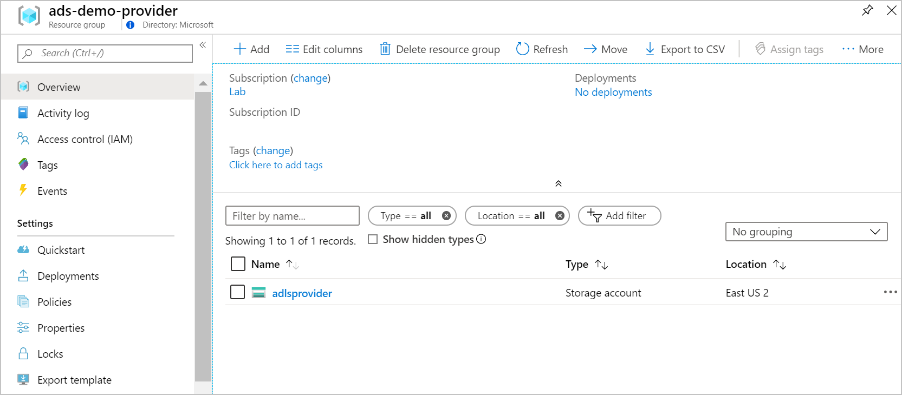
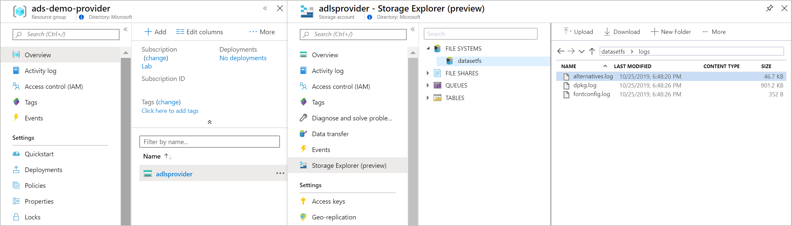
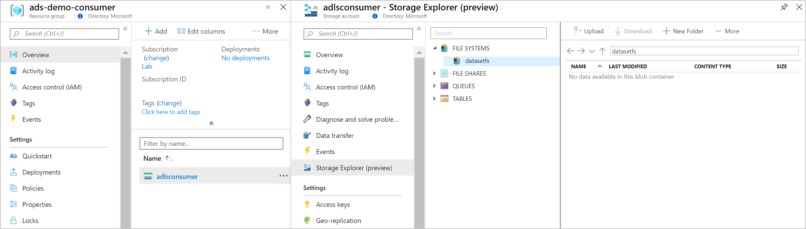
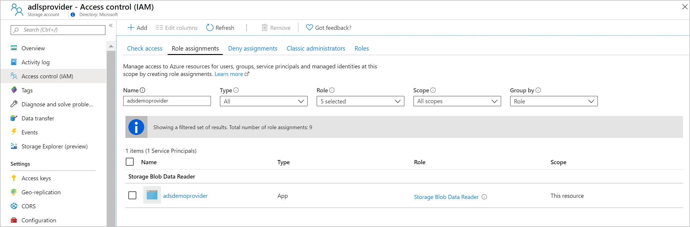
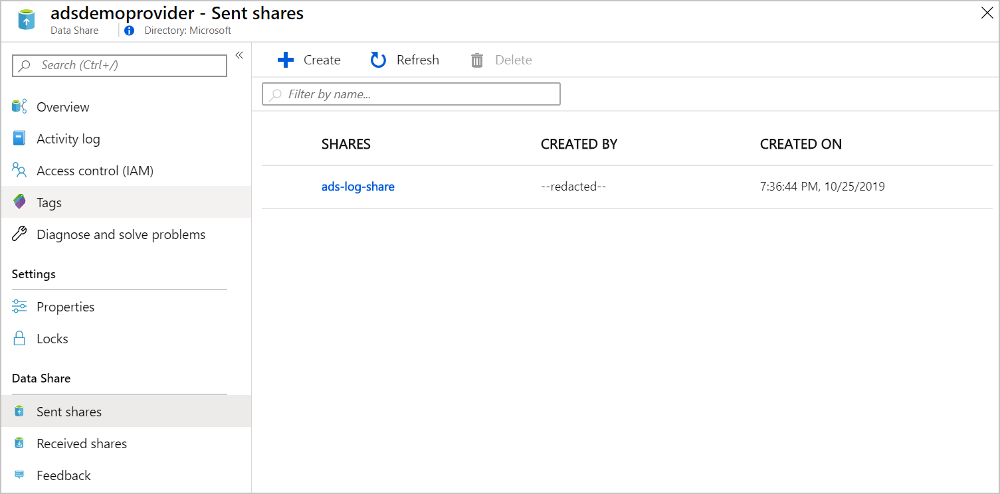
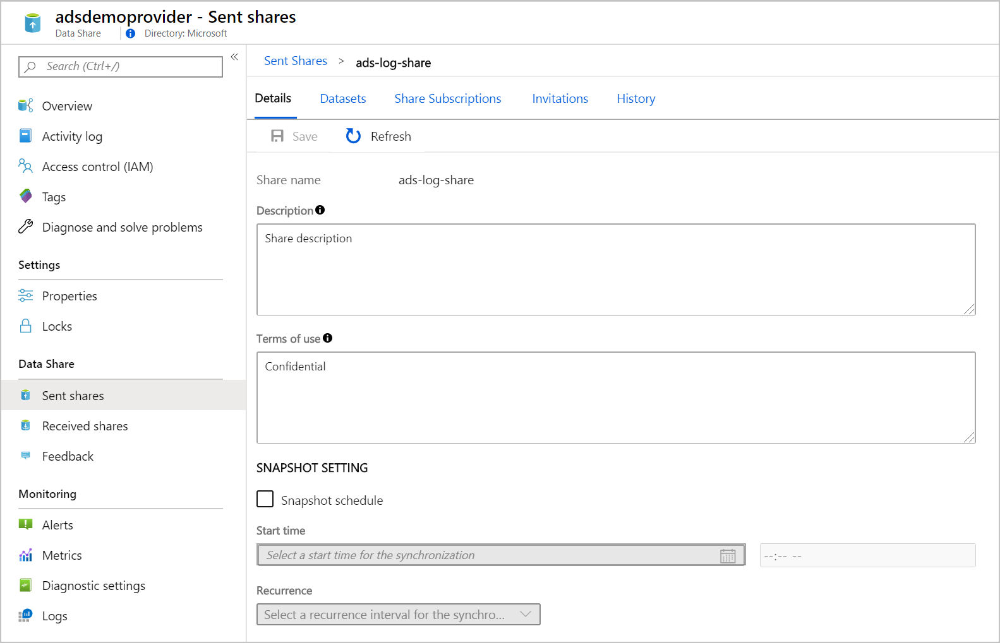
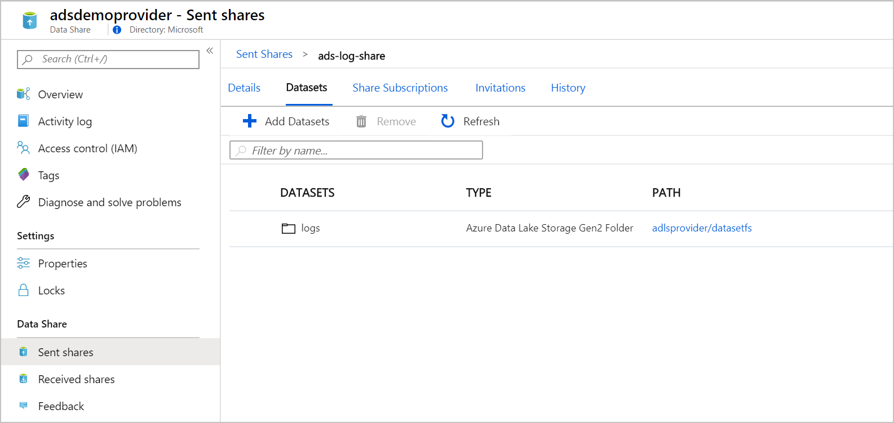
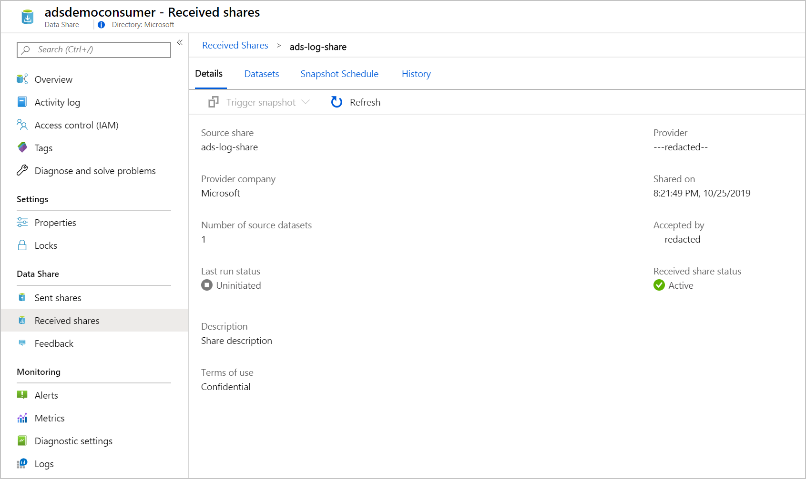
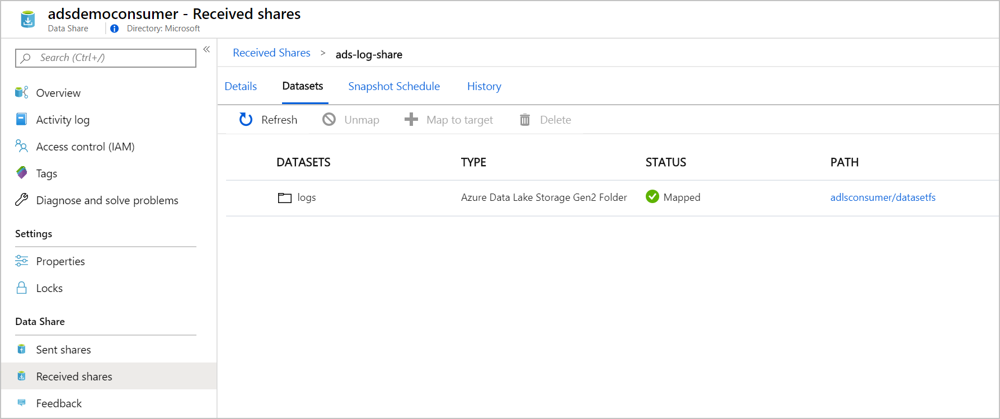
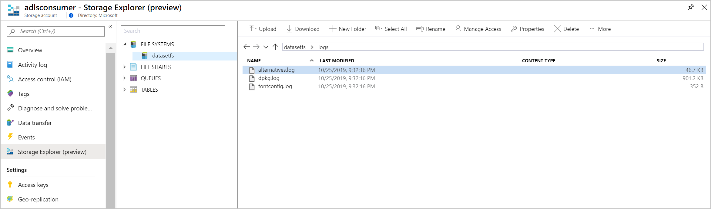

# Configure Azure Data Share using REST APIs

In this tutorial, you will configure Azure Data Share (ADS) through REST APIs for Provider and Consumer integration flows. You will use Azure Data Lake Store Gen 2 (ADLS Gen 2) as the source and destination storage accounts and configure ADS to transfer data between the storage accounts on an hourly basis.

To simplify the tutorial, you will use `az rest` commands to invoke the ADS management endpoints.  `az rest` will automatically use the credentials from the user account or service principal that's logged in through `az login` and process the request & response flows.  You can learn more from the [Azure CLI documentation](https://docs.microsoft.com/cli/azure/reference-index?view=azure-cli-latest#az-rest).

You will be able to execute these steps through Azure Cloud Shell.

This tutorial will allow you to:

1. Create a Azure Data Share account and share data set
2. Configure role-based access control for sharing data between ADLS Gen 2 accounts
3. Schedule synchronization schedule
4. Send invitations through email to Consumer accounts
5. Accept the invitation, map dataset to ADLS Gen 2 account and monitor data transfers

This tutorial can be completed with multiple Azure subscription configurations, such as:

1. Provider and Consumer resources in the same subscription
2. Provider and Consumer resources in different subscriptions in the same Azure AD tenant
3. Provider and Consumer resources in different Azure AD tenants

For simplicity, we will create Provider and Consumer resources in the same subscription and separate the resources into 2 different resource groups.

## Prerequisites

To complete the tutorial, launch Azure Cloud Shell with a Bash environment and follow through the prerequisites steps.  You will setup environment variables such that the management endpoints can be dynamically generated at execution time.

#### Setup environment variables

Fill in the parameters `PROVIDER_SUBSCRIPTION_ID`, `CONSUMER_SUBSCRIPTION_ID` and `CONSUMER_EMAIL_ADDRESS` and adjust the other parameters based on your environment.

```bash
# data share api version
export DATA_SHARE_API_VERSION="2018-11-01-preview"

# environment variables for Provider flows
export PROVIDER_SUBSCRIPTION_ID=""
export PROVIDER_RESOURCE_GROUP="ads-demo-provider"
export PROVIDER_LOCATION="eastus2"
export PROVIDER_DATASHARE_ACCOUNT_NAME="adsdemoprovider"
export PROVIDER_DATASHARE_SHARE_NAME="ads-log-share"
export PROVIDER_DATASHARE_SHARE_DATASET_NAME="dataset1"
export PROVIDER_ADLSGEN2_NAME="adlsprovider"
export PROVIDER_ADLSGEN2_FS="datasetfs"
export PROVIDER_ADLSGEN2_DATASET_PATH="logs"

# environment variables for Consumer flows
export CONSUMER_SUBSCRIPTION_ID=""
export CONSUMER_RESOURCE_GROUP="ads-demo-consumer"
export CONSUMER_LOCATION="eastus2"
export CONSUMER_DATASHARE_ACCOUNT_NAME="adsdemoconsumer"
export CONSUMER_ADLSGEN2_NAME="adlsconsumer"
export CONSUMER_ADLSGEN2_FS="datasetfs"
export CONSUMER_ADLSGEN2_DATASET_PATH="logs"
export CONSUMER_EMAIL_ADDRESS=""
```

#### Create Resource Groups

Create two resource groups; one for Provider and another for Consumer.  Each resource group will contain:

* ADLS Gen 2 storage account
* ADS Account

```bash
az group create -n $PROVIDER_RESOURCE_GROUP -l $PROVIDER_LOCATION
az group create -n $CONSUMER_RESOURCE_GROUP -l $CONSUMER_LOCATION
```

#### Create ADLS Gen 2 Storage Accounts

Create two ADLS Gen 2 storage accounts.  To enable ADLS Gen 2 CLI support, add the `storage-preview` extension.

```bash
# Add CLI extension for ADLS Gen 2
az extension add --name storage-preview

# Create Provider Storage Account
az storage account create --sku Standard_LRS --kind StorageV2 --hierarchical-namespace true -l $PROVIDER_LOCATION -g $PROVIDER_RESOURCE_GROUP -n $PROVIDER_ADLSGEN2_NAME

# Create Consumer Storage Account
az storage account create --sku Standard_LRS --kind StorageV2 --hierarchical-namespace true -l $CONSUMER_LOCATION -g $CONSUMER_RESOURCE_GROUP -n $CONSUMER_ADLSGEN2_NAME
```



#### Setup filesystem and seed data to the Provider storage account

Create a filesystem on the storage account using the `az storage container` command.  Once the filesystem is created, upload a sample dataset (files can be uploaded with nested folders).

```bash
# Retrieve the storage account connection string for Provider storage account
export AZURE_STORAGE_CONNECTION_STRING=`az storage account show-connection-string -g $PROVIDER_RESOURCE_GROUP -n $PROVIDER_ADLSGEN2_NAME -o json --query "connectionString"`

# Create a filesystem
az storage container create --name $PROVIDER_ADLSGEN2_FS

# Upload files from local machine - change the source to your location.  The example will upload data to logs folder (i.e. full path will start with datasetfs/logs/)
az storage blob upload-batch --source . --destination $PROVIDER_ADLSGEN2_FS --destination-path $PROVIDER_ADLSGEN2_DATASET_PATH
```



#### Setup filesystem for the Consumer storage account

Create a filesystem on the storage account using the `az storage container` command.  Data from the Provider storage account will be copied to this filesystem in subsequent steps.

To upload data, set the environment variable `AZURE_STORAGE_CONNECTION_STRING` with the connection string of the storage account.  This information is extracted using the `--query` Azure CLI option.

```bash
# Retrieve the storage account connection string for Provider storage account
export AZURE_STORAGE_CONNECTION_STRING=`az storage account show-connection-string -g $CONSUMER_RESOURCE_GROUP -n $CONSUMER_ADLSGEN2_NAME -o json --query "connectionString"`

# Create a filesystem
az storage container create --name $CONSUMER_ADLSGEN2_FS
```



## Configure Azure Data Share for Provider

#### Step 1: Create Azure Data Share account

Create an Azure Data Share account that will define the settings for data shares, data sets, invitations and  synchronization profiles.

**Payload**

```json
{
  "location": "$PROVIDER_LOCATION",
  "identity": {
    "type": "SystemAssigned"
  }
}
```

**REST API**

Use [HTTP PUT](https://docs.microsoft.com/en-us/rest/api/datashare/accounts/create) to create a new Azure Data Share account.

```bash
az rest -m PUT -u "https://management.azure.com/subscriptions/$PROVIDER_SUBSCRIPTION_ID/resourceGroups/$PROVIDER_RESOURCE_GROUP/providers/Microsoft.DataShare/accounts/$PROVIDER_DATASHARE_ACCOUNT_NAME?api-version=$DATA_SHARE_API_VERSION" --body "{\"location\": \"$PROVIDER_LOCATION\", \"identity\": { \"type\": \"SystemAssigned\"}}" --output-file /tmp/provider-create-api-output.json

cat /tmp/provider-create-api-output.json | jq
```

**Output**

`principalId` is the Managed Service Identity that is automatically created for the Azure Data Share account.  This service principal will need to be granted read permissions.

```json
{
  "identity": {
    "type": "SystemAssigned",
    "principalId": "6af8b838-cf60-40ae-a6aa-419e0c39c254",
    "tenantId": "--redacted--"
  },
  "properties": {
    "createdAt": "2019-10-25T2 3:13:35.6740605Z",
    "createdBy": "--redacted--",
    "provisioningState": "Creating"
  },
  "id": "/subscriptions/$PROVIDER_SUBSCRIPTION_ID/resourceGroups/$PROVIDER_RESOURCE_GROUP/providers/Microsoft.DataShare/accounts/$PROVIDER_DATASHARE_ACCOUNT_NAME",
  "name": "$PROVIDER_DATASHARE_ACCOUNT_NAME",
  "type": "Microsoft.DataShare/accounts",
  "location": "$PROVIDER_LOCATION"
}
```

#### Step 2: Configure read permissions for Azure Data Share account

Grant `Storage Blob Data Reader` [role](https://docs.microsoft.com/en-us/azure/data-share/concepts-roles-permissions#data-providers) to the ADLS Gen 2 account so that Azure Data Share account can read and share data with the consumers.


```bash
export PROVIDER_DATASHARE_ACCOUNT_MSI="6af8b838-cf60-40ae-a6aa-419e0c39c254"

az role assignment create --role "Storage Blob Data Reader" --assignee-object-id $PROVIDER_DATASHARE_ACCOUNT_MSI --scope /subscriptions/$PROVIDER_SUBSCRIPTION_ID/resourceGroups/$PROVIDER_RESOURCE_GROUP/providers/Microsoft.Storage/storageAccounts/$PROVIDER_ADLSGEN2_NAME
```



#### Step 3: Create Share

Use [HTTP PUT](https://docs.microsoft.com/en-us/rest/api/datashare/shares/create) to create a new Share.

**Payload**

```json
{
  "properties": {
    "description": "Share description",
    "terms": "Confidential",
    "shareKind": "CopyBased"
  }
}
```

**REST API**

```bash
az rest -m PUT -u "https://management.azure.com/subscriptions/$PROVIDER_SUBSCRIPTION_ID/resourceGroups/$PROVIDER_RESOURCE_GROUP/providers/Microsoft.DataShare/accounts/$PROVIDER_DATASHARE_ACCOUNT_NAME/shares/$PROVIDER_DATASHARE_SHARE_NAME?api-version=$DATA_SHARE_API_VERSION" --body "{ \"properties\": { \"description\": \"Share description\", \"terms\": \"Confidential\", \"shareKind\": \"CopyBased\" } }" --output-file /tmp/provider-create-data-share.json
```






#### Step 4: Create Data Set

Use [HTTP PUT](https://docs.microsoft.com/en-us/rest/api/datashare/datasets/create) to create a new Data Set in the Share.

**Payload**

```json
{
  "kind": "AdlsGen2Folder",
  "properties": {
    "storageAccountName": "$PROVIDER_ADLSGEN2_NAME",
    "resourceGroup": "$PROVIDER_RESOURCE_GROUP",
    "fileSystem": "$PROVIDER_ADLSGEN2_FS",
    "folderPath": "$PROVIDER_ADLSGEN2_DATASET_PATH",
    "subscriptionId": "$PROVIDER_SUBSCRIPTION_ID"
  }
}
```

**REST API**

```bash
az rest -m PUT -u "https://management.azure.com/subscriptions/$PROVIDER_SUBSCRIPTION_ID/resourceGroups/$PROVIDER_RESOURCE_GROUP/providers/Microsoft.DataShare/accounts/$PROVIDER_DATASHARE_ACCOUNT_NAME/shares/$PROVIDER_DATASHARE_SHARE_NAME/dataSets/$PROVIDER_DATASHARE_SHARE_DATASET_NAME?api-version=$DATA_SHARE_API_VERSION" --body "{ \"kind\": \"AdlsGen2Folder\", \"properties\": { \"storageAccountName\": \"$PROVIDER_ADLSGEN2_NAME\", \"resourceGroup\": \"$PROVIDER_RESOURCE_GROUP\", \"fileSystem\": \"$PROVIDER_ADLSGEN2_FS\", \"folderPath\": \"$PROVIDER_ADLSGEN2_DATASET_PATH\", \"subscriptionId\": \"$PROVIDER_SUBSCRIPTION_ID\" } }" --output-file /tmp/provider-dataset-output.json
```




#### Step 5: Create Synchronization Schedule

Use [HTTP PUT](https://docs.microsoft.com/en-us/rest/api/datashare/synchronizationsettings/create) to create a new synchronization profile.

**Payload**

```json
{
  "kind": "ScheduleBased",
  "properties": {
    "synchronizationTime": "2019-01-01T01:00:52.9614956Z",
    "recurrenceInterval": "Hour",
    "synchronizationMode": "Incremental"
  }
}
```

**REST API**

```bash
az rest -m PUT -u "https://management.azure.com/subscriptions/$PROVIDER_SUBSCRIPTION_ID/resourceGroups/$PROVIDER_RESOURCE_GROUP/providers/Microsoft.DataShare/accounts/$PROVIDER_DATASHARE_ACCOUNT_NAME/shares/$PROVIDER_DATASHARE_SHARE_NAME/synchronizationSettings/hourlysync?api-version=$DATA_SHARE_API_VERSION" --body "{  \"kind\": \"ScheduleBased\",   \"properties\": {     \"synchronizationTime\": \"2019-01-01T01:00:52.9614956Z\",     \"recurrenceInterval\": \"Hour\",     \"synchronizationMode\": \"Incremental\"  }}" --output-file /tmp/provider-sync-profile.json
```


#### Step 6: Create Invitation

Use [HTTP PUT](https://docs.microsoft.com/en-us/rest/api/datashare/invitations/create) to create a new invitation.  An invitation email will be sent to the value in `$CONSUMER_EMAIL_ADDRESS`.

**Payload**

```json
{
  "properties": {
    "targetEmail": "$CONSUMER_EMAIL_ADDRESS"
  }
}
```

**REST API**

```bash
az rest -m PUT -u "https://management.azure.com/subscriptions/$PROVIDER_SUBSCRIPTION_ID/resourceGroups/$PROVIDER_RESOURCE_GROUP/providers/Microsoft.DataShare/accounts/$PROVIDER_DATASHARE_ACCOUNT_NAME/shares/$PROVIDER_DATASHARE_SHARE_NAME/invitations/invite-user?api-version=$DATA_SHARE_API_VERSION" --body "{ \"properties\": { \"targetEmail\": \"$CONSUMER_EMAIL_ADDRESS\" } }" --output-file /tmp/provider-invite.json
```


**Sample invitation email**


## Configure Azure Data Share for Consumer

#### Step 1:  Create Azure Data Share for Consumer

Use [HTTP PUT](https://docs.microsoft.com/en-us/rest/api/datashare/accounts/create) to create a new Azure Data Share account.

**Payload**

```json
{
  "location": "$CONSUMER_LOCATION",
  "identity": {
    "type": "SystemAssigned"
  }
}
```

**REST API**

```bash
az rest -m PUT -u "https://management.azure.com/subscriptions/$CONSUMER_SUBSCRIPTION_ID/resourceGroups/$CONSUMER_RESOURCE_GROUP/providers/Microsoft.DataShare/accounts/$CONSUMER_DATASHARE_ACCOUNT_NAME?api-version=$DATA_SHARE_API_VERSION" --body "{\"location\": \"$CONSUMER_LOCATION\", \"identity\": { \"type\": \"SystemAssigned\"}}" --output-file /tmp/consumer-create-api-output.json

cat /tmp/consumer-create-api-output.json | jq
```

**Output**

`principalId` is the Managed Service Identity that is automatically created for the Azure Data Share account.  This service principal will need to be granted write permissions.

```json
{
  "identity": {
    "type": "SystemAssigned",
    "principalId": "31c1bef0-23b2-49f5-aef2-4e3ec58c304c",
    "tenantId": "--redacted--"
  },
  "properties": {
    "createdAt": "2019-10-26T0 0:07:21.4617853Z",
    "createdBy": "--redacted--",
    "provisioningState": "Creating"
  },
  "id": "/subscriptions/$CONSUMER_SUBSCRIPTION_ID/resourceGroups/$CONSUMER_RESOURCE_GROUP/providers/Microsoft.DataShare/accounts/$CONSUMER_DATASHARE_ACCOUNT_NAME",
  "name": "$CONSUMER_DATASHARE_ACCOUNT_NAME",
  "type": "Microsoft.DataShare/accounts",
  "location": "$CONSUMER_LOCATION"
}
```

#### Step 2: Configure write permissions for Azure Data Share account

Grant `Storage Blob Data Contributor` [role](https://docs.microsoft.com/en-us/azure/data-share/concepts-roles-permissions#data-consumer) to the ADLS Gen 2 account so that Azure Data Share account can write data.

```bash
export CONSUMER_DATASHARE_ACCOUNT_MSI="31c1bef0-23b2-49f5-aef2-4e3ec58c304c"

az role assignment create --role "Storage Blob Data Contributor" --assignee-object-id $CONSUMER_DATASHARE_ACCOUNT_MSI --scope /subscriptions/$CONSUMER_SUBSCRIPTION_ID/resourceGroups/$CONSUMER_RESOURCE_GROUP/providers/Microsoft.Storage/storageAccounts/$CONSUMER_ADLSGEN2_NAME
```


#### Step 3: Identify invitations

Use [HTTP GET](https://docs.microsoft.com/en-us/rest/api/datashare/consumerinvitations/listinvitations) to list the invitations.  The invitation information will be used to subscribe to the data sets.

**REST API**

```bash
az rest -m GET -u "https://management.azure.com/providers/Microsoft.DataShare/ListInvitations?api-version=$DATA_SHARE_API_VERSION" --output-file /tmp/consumer-invitations-output.json

cat /tmp/consumer-invitations-output.json | jq
```

**Output**

```json
{
  "value": [
    {
      "properties": {
        "description": "Share description",
        "dataSetCount": 1,
        "invitationId": "6b350371-d163-433f-af0f-3ae1fa25cafc",
        "invitationStatus": "Pending",
        "location": "eastus2",
        "sender": "--redacted--",
        "senderCompanyName": "Microsoft",
        "shareName": "ads-log-share",
        "sentAt": "2019-10-25T23:56:58.0364311Z",
        "termsOfUse": "Confidential"
      },
      "id": "/providers/Microsoft.DataShare/consumerInvitations/6b350371-d163-433f-af0f-3ae1fa25cafc",
      "name": "invite-user",
      "type": "Microsoft.DataShare/consumerInvitations"
    }
  ]
}
```

#### Step 4:  Set additional environment variables based on invitation

```bash
# value from shareName attribute in the response 
export CONSUMER_SOURCE_SHARE_NAME="ads-log-share"
export CONSUMER_INVITATION_ID="6b350371-d163-433f-af0f-3ae1fa25cafc"
```

#### Step 5:  Subscribe to the invitation

Use [HTTP PUT](https://docs.microsoft.com/en-us/rest/api/datashare/sharesubscriptions/create) to subscribe.

**Payload**

```json
{
  "properties": {
    "invitationId": "$CONSUMER_INVITATION_ID"
  }
}
```

**REST API**

```bash
az rest -m PUT -u "https://management.azure.com/subscriptions/$CONSUMER_SUBSCRIPTION_ID/resourceGroups/$CONSUMER_RESOURCE_GROUP/providers/Microsoft.DataShare/accounts/$CONSUMER_DATASHARE_ACCOUNT_NAME/shareSubscriptions/$CONSUMER_SOURCE_SHARE_NAME?api-version=$DATA_SHARE_API_VERSION" --body "{ \"properties\": { \"invitationId\": \"$CONSUMER_INVITATION_ID\" } }"
```




#### Step 6:  Identify data sets available on the share

Use [HTTP GET](https://docs.microsoft.com/en-us/rest/api/datashare/consumersourcedatasets/listbysharesubscription) to identify the data sets associated with the data share. 

**REST API**

```bash
az rest -m GET -u "https://management.azure.com/subscriptions/$CONSUMER_SUBSCRIPTION_ID/resourceGroups/$CONSUMER_RESOURCE_GROUP/providers/Microsoft.DataShare/accounts/$CONSUMER_DATASHARE_ACCOUNT_NAME/shareSubscriptions/$CONSUMER_SOURCE_SHARE_NAME/ConsumerSourceDataSets?api-version=$DATA_SHARE_API_VERSION" --output-file /tmp/consumer-datasets-on-share-output.json

cat /tmp/consumer-datasets-on-share-output.json | jq
```

**Output**

```json
{
  "value": [
    {
      "properties": {
        "dataSetName": "logs",
        "dataSetId": "e3f48b13-e333-4750-8027-f2325a571619",
        "dataSetType": "AdlsGen2Folder"
      },
      "id": "/subscriptions/$CONSUMER_SUBSCRIPTION_ID/resourceGroups/$CONSUMER_RESOURCE_GROUP/providers/Microsoft.DataShare/accounts/$CONSUMER_DATASHARE_ACCOUNT_NAME/shareSubscriptions/$CONSUMER_SOURCE_SHARE_NAME/consumerSourceDataSets/dataset1",
      "name": "dataset1",
      "type": "Microsoft.DataShare/ConsumerSourceDataSet"
    }
  ]
}
```

#### Step 7:  Set additional environment variables based on invitation

```bash
# value from properties.datasetId
export CONSUMER_SOURCE_DATASET_ID="e3f48b13-e333-4750-8027-f2325a571619"
```

#### Step 8:  Create Data Set mapping to destination ADLS Gen 2 Storage ACcount

Use [HTTP PUT](https://docs.microsoft.com/en-us/rest/api/datashare/datasetmappings/create) to map the source data set to destination data set.

**Payload**

```json
{
  "kind": "AdlsGen2Folder",
  "properties": {
    "datasetId": "$CONSUMER_SOURCE_DATASET_ID",
    "storageAccountName": "$CONSUMER_ADLSGEN2_NAME",
    "folderPath": "$CONSUMER_ADLSGEN2_DATASET_PATH",
    "fileSystem": "$CONSUMER_ADLSGEN2_FS",
    "subscriptionId": "$CONSUMER_SUBSCRIPTION_ID",
    "resourceGroup": "$CONSUMER_RESOURCE_GROUP"
  }
}
```

**REST API**

```bash
az rest -m PUT -u "https://management.azure.com/subscriptions/$CONSUMER_SUBSCRIPTION_ID/resourceGroups/$CONSUMER_RESOURCE_GROUP/providers/Microsoft.DataShare/accounts/$CONSUMER_DATASHARE_ACCOUNT_NAME/shareSubscriptions/$CONSUMER_SOURCE_SHARE_NAME/dataSetMappings/mapping?api-version=$DATA_SHARE_API_VERSION" --body "{ \"kind\": \"AdlsGen2Folder\", \"properties\": { \"datasetId\": \"$CONSUMER_SOURCE_DATASET_ID\", \"storageAccountName\": \"$CONSUMER_ADLSGEN2_NAME\",\"folderPath\": \"$CONSUMER_ADLSGEN2_DATASET_PATH\", \"fileSystem\": \"$CONSUMER_ADLSGEN2_FS\", \"subscriptionId\": \"$CONSUMER_SUBSCRIPTION_ID\", \"resourceGroup\": \"$CONSUMER_RESOURCE_GROUP\" }}"
```




#### Step 9:  List data synchronization settings

Use [HTTP POST](https://docs.microsoft.com/en-us/rest/api/datashare/sharesubscriptions/listsourcesharesynchronizationsettings) to identify the synchronization settings.  These settings will be used to enable sync.

**REST API**

```bash
az rest -m post -u "https://management.azure.com/subscriptions/$CONSUMER_SUBSCRIPTION_ID/resourceGroups/$CONSUMER_RESOURCE_GROUP/providers/Microsoft.DataShare/accounts/$CONSUMER_DATASHARE_ACCOUNT_NAME/shareSubscriptions/$CONSUMER_SOURCE_SHARE_NAME/listSourceShareSynchronizationSettings?api-version=$DATA_SHARE_API_VERSION" --output-file /tmp/consumer-sync-settings-output.json

cat /tmp/consumer-sync-settings-output.json | jq
```

**Output**

```json
{
  "value": [
    {
      "properties": {
        "recurrenceInterval": "Hour",
        "synchronizationTime": "2019-01-01T01:00:52.9614956Z"
      },
      "kind": "ScheduleBased"
    }
  ]
}
```

#### Step 10:  Set additional environment variables based on invitation

```bash
# value from properties.datasetId
export CONSUMER_SYNC_RECURRENCE="Hour"
export CONSUMER_SYNC_TIME="2019-01-01T01:00:52.9614956Z"
```

#### Step 11:  Trigger incremental synchronization

Use [HTTP PUT](https://docs.microsoft.com/en-us/rest/api/datashare/triggers/create) to enable incremental synchronization.

**Payload**

```json
{
  "kind": "ScheduleBased",
  "properties": {
    "synchronizationTime": "$CONSUMER_SYNC_TIME",
    "recurrenceInterval": "$CONSUMER_SYNC_RECURRENCE",
    "synchronizationMode": "Incremental"
  }
}
```

**REST API**

```bash
az rest -m PUT -u "https://management.azure.com/subscriptions/$CONSUMER_SUBSCRIPTION_ID/resourceGroups/$CONSUMER_RESOURCE_GROUP/providers/Microsoft.DataShare/accounts/$CONSUMER_DATASHARE_ACCOUNT_NAME/shareSubscriptions/$CONSUMER_SOURCE_SHARE_NAME/triggers/incrementaltrigger?api-version=$DATA_SHARE_API_VERSION" --body "{ \"kind\": \"ScheduleBased\", \"properties\": { \"synchronizationTime\": \"$CONSUMER_SYNC_TIME\", \"recurrenceInterval\": \"$CONSUMER_SYNC_RECURRENCE\", \"synchronizationMode\": \"Incremental\" } }"
```


#### Step 12:  Validate synchronized data

Wait for the data to synchronize or use Azure Portal to trigger a full synchronization.  Upon completion, verify that the data has been copied to the Consumer's storage account.  Since this tutorial is configured with hourly sync, any files uploaded to the Provider's storage account will be copied to the Consumer every hour.


**Data copied to destination ADLS Gen 2 storage account**



## Clean Up

You can delete the resource groups to clean up all of the resources.

```bash
az group delete -n $PROVIDER_RESOURCE_GROUP -y --no-wait
az group delete -n $CONSUMER_RESOURCE_GROUP -y --no-wait
```

## References

* [Azure CLI - az rest](https://docs.microsoft.com/en-us/cli/azure/reference-index?view=azure-cli-latest#az-rest)
* [Azure Data Share Permissions](https://docs.microsoft.com/en-us/azure/data-share/concepts-roles-permissions)
* [Provider - Create Data Share Account](https://docs.microsoft.com/en-us/rest/api/datashare/accounts/create)
* [Provider - Create Share](https://docs.microsoft.com/en-us/rest/api/datashare/shares/create)
* [Provider - Create Data Set](https://docs.microsoft.com/en-us/rest/api/datashare/datasets/create)
* [Provider - Setup Synchronization Settings](https://docs.microsoft.com/en-us/rest/api/datashare/synchronizationsettings/create)
* [Provider - Create email invitation](https://docs.microsoft.com/en-us/rest/api/datashare/invitations/create)
* [Consumer - List invitations](https://docs.microsoft.com/en-us/rest/api/datashare/consumerinvitations/listinvitations)
* [Consumer - Accept invitation and subscribe](https://docs.microsoft.com/en-us/rest/api/datashare/sharesubscriptions/create)
* [Consumer - List shares on the invitation](https://docs.microsoft.com/en-us/rest/api/datashare/consumersourcedatasets/listbysharesubscription)
* [Consumer - Create Data Set mapping](https://docs.microsoft.com/en-us/rest/api/datashare/datasetmappings/create)
* [Consumer - Get Synchronization Settings](https://docs.microsoft.com/en-us/rest/api/datashare/sharesubscriptions/listsourcesharesynchronizationsettings)
* [Consumer - Enable incremental synchronization](https://docs.microsoft.com/en-us/rest/api/datashare/triggers/create)